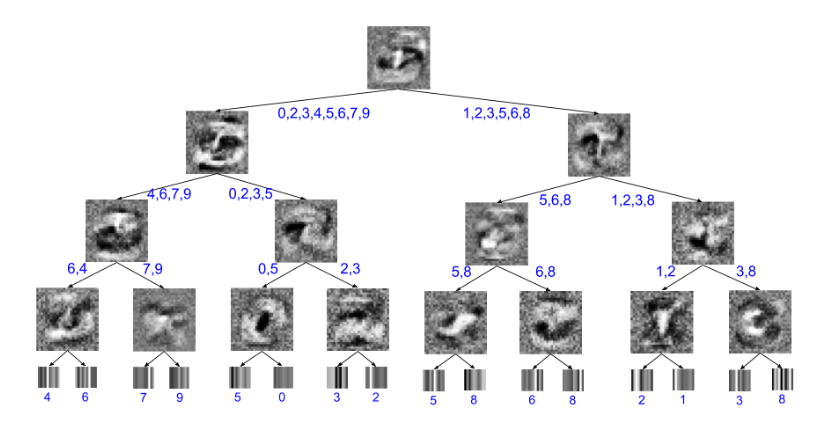

# Soft-Decision-Tree

Soft-Decision-Tree is the pytorch implementation of [Distilling a Neural Network Into a Soft Decision
Tree](https://arxiv.org/pdf/1711.09784.pdf), paper recently published on Arxiv about adopting decision tree algorithm into neural network.
"If we could take the knowledge acquired by the neural net and express the same knowledge in a model that relies on hierarchical decisions instead, explaining a particular decision would be much easier."

## Requirements

- python
- [pytorch](https://pytorch.org/)

## Result

I achieved 92.95% of test dataset accuracy on MNISTafter 40 epoches, without exploring enough of hyper-parameters (The paper achieved 94.45%). Higher accuracy might be achievable with searching hyper-parameters, or training longer epoches (if you can, please let me know :) )

## Usage

   $ python main.py
